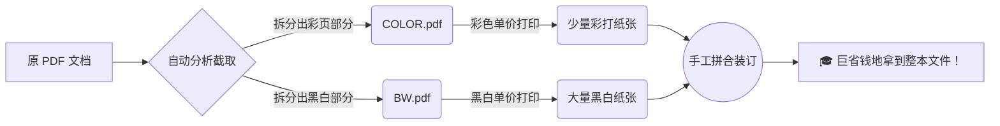

# Colorful PDF Splitter - 彩色 PDF 分割器

彩色文件打印往往按页计费，价格高昂。尤其是到了毕业季，自行打印大论文，价格更是令人肉疼。Colorful PDF Splitter 是分割 PDF
文件的工具，能够将彩色页和黑白页分开，从而帮助用户节省打印成本。



## 背景

在许多场景下（比如毕业季打印动辄上百页的大论文），如果不予报销，自行去打印店彩打的价格是非常昂贵的。
打印店通常的计费规则是：**如果选择整体彩打，即使是原本纯黑白的部分，也会统一按照彩打的高单价来算钱。**

由于一份 PDF 文件中，彩色页的数量通常远远少于黑白页。为了节省这笔高额差价，我们可以将 PDF 文件全自动地分割成两部分：一部分只包含所有彩色页，另一部分包含纯黑白页。
这样，我们就可以利用最便宜的正规黑白打印机来打印绝大多数内容，只花钱彩打少数几张图表页。印完两个文件后，虽然**需要自己手工把彩打的纸张对应插回**黑白稿中拼合，但这能实打实地省下一大笔费用。

然而，手动提取和分割 PDF 文件既麻烦又极易出错。特别是**以双面打印为例**：不仅需要挑出彩色页，还必须考虑它的反面——因为如果你要双面打印在一张纸上，只要这页是彩色，它的背面即使纯黑白，也必须一起划给彩色打印机。
手动操作不仅耗时，还极其容易遗漏或破坏掉原本的奇偶页结构。

经过简单调研，暂未发现解决类似问题的工具。因此，Colorful PDF Splitter 应运而生。它的输入是一个 PDF，输出为两个 PDF
文件：一个包含所有需要彩打的页面（并在双页模式下智能补偿背面），另一个则包含所有黑白页。用户只需一步操作，即可安全无痛地完成分割。

## 快速开始

请先使用 `pip install -r requirements.txt` 安装所需依赖。随后在项目文件夹下执行命令以使用此工具。执行完的下面的命令后，您将在 PDF 目录下看到文件名称后缀为 `-BW.pdf` 和 `-COLOR.pdf` 的两个新文件，它们是需要分别黑白或彩色打印的文件。如果需要全彩打印或全黑白打印，则只生成一个文件；若 PDF 为空，则不会生成任何文件。

下面以从 [File Format 网站下载的示例 PDF](https://docs.fileformat.com/pdf/download-pdf/) 为例，来展示两种模式的使用方法。

### 双页打印模式（默认）

预期您输入的每一个 PDF 都将被双页打印。在此情况下，每一个带有彩色内容的页及其背面都将输出指彩色 PDF
中。程序将智能地考虑文档总页数为奇数或偶数的情况。

```bash
python main.py docs/examples/SamplePDF-500kb-Text-Images-Links-9Pages.pdf
```

### 单页打印模式

使用 `--single-page` 指定使用单页打印模式，否则默认为双页打印模式。在此情况下，每一个彩色内容的页将输出到彩色 PDF
中，而不考虑其背面内容（除非也是彩色）。

```bash
python main.py --single-page docs/examples/SamplePDF-500kb-Text-Images-Links-9Pages.pdf
```

## 进阶

### 自动处理文件覆盖冲突 (`-y` / `-n`)

如果您需要进行批量化脚本调用（例如集成在完全自动化的工作流中），为了防止程序在遇到重名结果文件时阻塞等待输入，您可以使用以下标志：

- `-y` (或 `--yes`)：自动确认覆盖已经存在的拆分结果文件。
- `-n` (或 `--no`)：自动拒绝覆盖，当遇到已存在同名输出文件时直接跳过这个 PDF 的处理。

```bash
# 例子：若发现文件已存在，则自动跳过
python main.py -n docs/examples/SamplePDF-500kb-Text-Images-Links-9Pages.pdf
```

### 演练运行 (`--dry-run`)

如果您并不想现在就耗费时间去保存输出文件（例如对于几GB或上百页体量的大书），只想立刻知道它统计出的彩色页码范围是什么（或者只用来辅助决定该单独用 Word 打哪些页），你可以加上 `--dry-run`。
加入该标志后，程序将仅仅去检测和输出统计结果（即打印在控制台上的那些 `彩色排布: 1-5, 8` 等），绝对不会写入、覆盖任何文件或文件夹。

```bash
python main.py --dry-run docs/examples/SamplePDF-500kb-Text-Images-Links-9Pages.pdf
```

### 指定输出文件夹 (`--out`)

使用 `--out` 或 `-o` 指定拆分后的 PDF 文件存放位置。如果文件夹不存在将被自动创建。

```bash
python main.py --out output/ docs/examples/SamplePDF-500kb-Text-Images-Links-9Pages.pdf
```

由于程序是通过将 PDF 页面渲染为图像，并比较原图与灰度图的差异来判断是否包含彩色内容，在某些极端情况下（如有微小的高压缩噪声色块），你可能会需要调整检测的精度参数。

### DPI (`--dpi`)

指定渲染页面以进行色彩检测时使用的内部 DPI，默认为 `36`。
可以将其调高以获得更精确的细节判定（例如检测极小的彩色文字），但会显著增加处理时间和系统内存的占用：

```bash
python main.py --dpi 72 docs/examples/SamplePDF-500kb-Text-Images-Links-9Pages.pdf
```

> **注意**：该 DPI 仅用来判断页面是否是彩色，**不会**影响最终导出的 PDF 的清晰度（输出的 PDF 是无损的逻辑切分，可以保留完美的矢量效果和原图画质）。

### 色彩阈值 (`--threshold`)

原图相较于灰度图在 RGB 颜色通道上的容差容忍值，默认为 `5` (范围 0-255)。

- 调大可以避免将非常接近灰色的轻微偏色（压缩噪点）误认为“彩色页面”。
- 调小使判断更加严苛，稍有一点偏色的色差也会被分割为彩色页。

```bash
python main.py --threshold 10 docs/examples/SamplePDF-500kb-Text-Images-Links-9Pages.pdf
```

## 贡献代码

欢迎任何形式的贡献！无论是修复 bug、添加新功能，还是改进文档，都非常感谢。请随时提交 Pull Requests 或在 Issues 中提出建议。

贡献代码之前，请确保测试通过。例如，你可以使用以下命令运行测试：

```bash
python main.py .\docs\examples\SamplePDF-500kb-Text-Images-Links-9Pages.pdf --out .\docs\examples\double-pages\
python main.py .\docs\examples\SamplePDF-500kb-Text-Images-Links-9Pages.pdf --out .\docs\examples\single-page --single-page
```

## 许可证

```text
Copyright 2026 Chuanwise.

Licensed under the Apache License, Version 2.0 (the "License");
you may not use this file except in compliance with the License.
You may obtain a copy of the License at

    http://www.apache.org/licenses/LICENSE-2.0

Unless required by applicable law or agreed to in writing, software
distributed under the License is distributed on an "AS IS" BASIS,
WITHOUT WARRANTIES OR CONDITIONS OF ANY KIND, either express or implied.
See the License for the specific language governing permissions and
limitations under the License.
```
